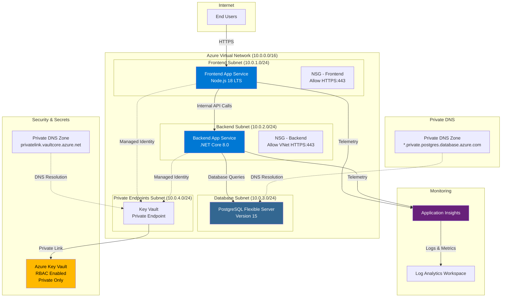
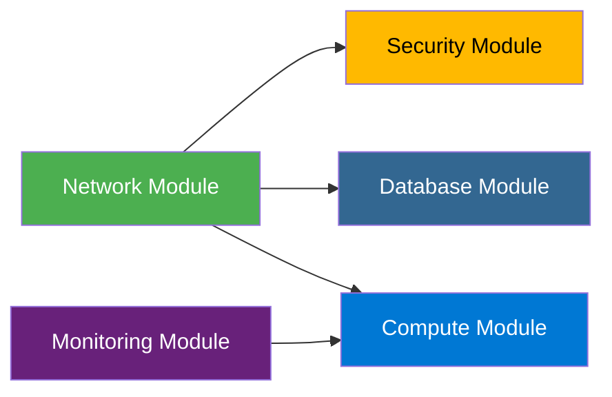

# Azure Infrastructure Architecture

## Architecture Diagram



---

## Traffic Flow

### 1. **User Request Flow**
```
[User Browser] 
    ↓ HTTPS (443)
[Frontend App Service (Node.js)]
    ↓ Internal VNet Call
[Backend App Service (.NET Core)]
    ↓ Database Connection (5432)
[PostgreSQL Flexible Server]
```

### 2. **Secrets Access Flow**
```
[App Service (System Managed Identity)]
    ↓ Private Endpoint (10.0.4.0/24)
[Key Vault Private Endpoint]
    ↓ Private Link
[Azure Key Vault]
```

### 3. **Monitoring & Telemetry Flow**
```
[App Services]
    ↓ Application Insights SDK
[Application Insights]
    ↓ Logs/Metrics
[Log Analytics Workspace]
```

---

## Components

### 🌐 **Network Infrastructure**

#### **Virtual Network (VNet)**
- **Resource Type:** `Microsoft.Network/virtualNetworks`
- **Address Space:** `10.0.0.0/16`
- **Location:** Configurable (defaults to Resource Group location)
- **Purpose:** Provides network isolation and secure communication between resources

#### **Subnets**

| Subnet Name | Address Range | Purpose | Delegation |
|-------------|---------------|---------|------------|
| `snet-frontend` | 10.0.1.0/24 | Frontend App Service VNet Integration | Microsoft.Web/serverFarms |
| `snet-backend` | 10.0.2.0/24 | Backend App Service VNet Integration | Microsoft.Web/serverFarms |
| `snet-database` | 10.0.3.0/24 | PostgreSQL Flexible Server | Microsoft.DBforPostgreSQL/flexibleServers |
| `snet-private-endpoints` | 10.0.4.0/24 | Private Endpoints (Key Vault) | None |

#### **Network Security Groups (NSGs)**

**NSG - Frontend**
- **Rules:**
  - Allow HTTPS (443) from Internet → Priority 100

**NSG - Backend**
- **Rules:**
  - Allow HTTPS (443) from VirtualNetwork → Priority 100

**📚 Documentation:** [Azure Virtual Network](https://learn.microsoft.com/en-us/azure/virtual-network/)

---

### 💻 **Compute Layer**

#### **App Service Plan**
- **Resource Type:** `Microsoft.Web/serverfarms`
- **Naming:** `plan-{projectName}-{environment}`
- **SKU:** Configurable (parameter: `appServicePlanSku`)
- **OS:** Linux (`reserved: true`)
- **Purpose:** Shared hosting plan for frontend and backend apps

#### **Frontend App Service**
- **Resource Type:** `Microsoft.Web/sites`
- **Naming:** `app-{projectName}-{environment}-web`
- **Runtime:** `NODE|18-lts`
- **Identity:** System Assigned Managed Identity
- **VNet Integration:** Connected to `snet-frontend`
- **Route All Enabled:** Yes (all outbound traffic through VNet)
- **Configuration:**
  - Application Insights instrumentation enabled
  - HTTPS only

#### **Backend App Service**
- **Resource Type:** `Microsoft.Web/sites`
- **Naming:** `app-{projectName}-{environment}-api`
- **Runtime:** `DOTNETCORE|8.0`
- **Identity:** System Assigned Managed Identity
- **VNet Integration:** Connected to `snet-backend`
- **Route All Enabled:** Yes (all outbound traffic through VNet)
- **Configuration:**
  - Application Insights instrumentation enabled
  - HTTPS only

**📚 Documentation:** [Azure App Service](https://learn.microsoft.com/en-us/azure/app-service/)

---

### 🗄️ **Database Layer**

#### **PostgreSQL Flexible Server**
- **Resource Type:** `Microsoft.DBforPostgreSQL/flexibleServers`
- **Naming:** `psql-{projectName}-{environment}`
- **Version:** PostgreSQL 15
- **SKU:** `Standard_B1ms` (Burstable tier)
- **Network Configuration:**
  - Deployed into delegated subnet (`snet-database`)
  - Private DNS Zone integration
  - No public access

#### **Private DNS Zone (Database)**
- **Resource Type:** `Microsoft.Network/privateDnsZones`
- **Zone Name:** `{serverName}.private.postgres.database.azure.com`
- **Location:** Global
- **VNet Link:** Linked to main VNet for DNS resolution
- **Purpose:** Enables private DNS resolution for PostgreSQL server

**📚 Documentation:** 
- [PostgreSQL Flexible Server](https://learn.microsoft.com/en-us/azure/postgresql/flexible-server/)
- [Private DNS Zones](https://learn.microsoft.com/en-us/azure/dns/private-dns-overview)

---

### 🔐 **Security Layer**

#### **Azure Key Vault**
- **Resource Type:** `Microsoft.KeyVault/vaults`
- **Naming:** `kv-{projectName}-{environment}-{uniqueString}`
- **SKU:** Standard
- **Access Model:** RBAC Authorization (modern best practice)
- **Public Access:** Disabled
- **Purpose:** Secure storage for secrets, keys, and certificates

#### **Key Vault Private Endpoint**
- **Resource Type:** `Microsoft.Network/privateEndpoints`
- **Naming:** `pe-kv-{projectName}-{environment}-{uniqueString}`
- **Subnet:** `snet-private-endpoints`
- **Private Link Service:** Key Vault (groupId: `vault`)
- **Purpose:** Enables private connectivity to Key Vault from VNet

#### **Private DNS Zone (Key Vault)**
- **Resource Type:** `Microsoft.Network/privateDnsZones`
- **Zone Name:** `privatelink.vaultcore.azure.net`
- **Location:** Global
- **VNet Link:** Linked to main VNet
- **DNS Zone Group:** Automatically manages A records for private endpoint
- **Purpose:** Resolves Key Vault FQDN to private IP address

**📚 Documentation:** 
- [Azure Key Vault](https://learn.microsoft.com/en-us/azure/key-vault/)
- [Private Link for Key Vault](https://learn.microsoft.com/en-us/azure/key-vault/general/private-link-service)

---

### 📊 **Monitoring Layer**

#### **Log Analytics Workspace**
- **Resource Type:** `Microsoft.OperationalInsights/workspaces`
- **Naming:** `law-{projectName}-{environment}`
- **SKU:** `PerGB2018` (Pay-as-you-go)
- **Purpose:** Centralized log storage and analytics

#### **Application Insights**
- **Resource Type:** `Microsoft.Insights/components`
- **Naming:** `appi-{projectName}-{environment}`
- **Kind:** Web
- **Application Type:** Web
- **Workspace Integration:** Connected to Log Analytics Workspace
- **Purpose:** Application performance monitoring (APM)

**📚 Documentation:** 
- [Application Insights](https://learn.microsoft.com/en-us/azure/azure-monitor/app/app-insights-overview)
- [Log Analytics](https://learn.microsoft.com/en-us/azure/azure-monitor/logs/log-analytics-overview)

---

## Security Features

### 🛡️ **Network Security**
- ✅ All resources deployed within VNet (no public access except frontend)
- ✅ NSGs control traffic between subnets
- ✅ Key Vault accessible only via Private Endpoint
- ✅ PostgreSQL accessible only from VNet (delegated subnet)
- ✅ App Services use VNet Integration with route-all enabled

### 🔑 **Identity & Access**
- ✅ System Managed Identities for App Services
- ✅ Key Vault uses RBAC authorization (no legacy access policies)
- ✅ No hardcoded credentials
- ✅ Secure parameters for sensitive data (pgAdminPassword)

### 🔒 **Data Protection**
- ✅ HTTPS enforced on all App Services
- ✅ Private DNS zones prevent DNS leakage
- ✅ Database in private subnet with delegation
- ✅ Secrets stored in Key Vault with private access

---

## DNS Resolution Flow

### **Key Vault Private Access**
```
App Service → Private Endpoint (10.0.4.x) → Private DNS Zone
    ↓
Resolves: kv-{name}.vault.azure.net → privatelink.vaultcore.azure.net → 10.0.4.x
    ↓
Private Link → Key Vault
```

### **PostgreSQL Private Access**
```
App Service → Database Subnet (10.0.3.x) → Private DNS Zone
    ↓
Resolves: psql-{name}.postgres.database.azure.com → {serverName}.private.postgres.database.azure.com → 10.0.3.x
    ↓
PostgreSQL Flexible Server
```

---

## Deployment Parameters

### **Required Parameters**
- `environment` - Environment name (dev, prod)
- `projectName` - Project short name
- `appServicePlanSku` - App Service Plan SKU
- `pgAdminLogin` - PostgreSQL administrator username
- `pgAdminPassword` - PostgreSQL administrator password (secure)

### **Optional Parameters**
- `location` - Azure region (defaults to resource group location)

---

## Resource Naming Convention

| Resource Type | Naming Pattern | Example |
|---------------|----------------|---------|
| Virtual Network | `vnet-{projectName}-{environment}` | `vnet-secureapi-dev` |
| App Service Plan | `plan-{projectName}-{environment}` | `plan-secureapi-dev` |
| Frontend App | `app-{projectName}-{environment}-web` | `app-secureapi-dev-web` |
| Backend App | `app-{projectName}-{environment}-api` | `app-secureapi-dev-api` |
| PostgreSQL Server | `psql-{projectName}-{environment}` | `psql-secureapi-dev` |
| Key Vault | `kv-{projectName}-{environment}-{hash}` | `kv-secureapi-dev-abc123` |
| Log Analytics | `law-{projectName}-{environment}` | `law-secureapi-dev` |
| App Insights | `appi-{projectName}-{environment}` | `appi-secureapi-dev` |

---

## Module Dependencies



### **Deployment Order**
1. **Network Module** - Creates VNet and subnets
2. **Monitoring Module** - Creates Log Analytics and App Insights (independent)
3. **Security Module** - Creates Key Vault with private endpoint (depends on Network)
4. **Database Module** - Creates PostgreSQL server (depends on Network)
5. **Compute Module** - Creates App Services (depends on Network and Monitoring)

---

## Links & References

### **Azure Documentation**
- [Azure Virtual Network](https://learn.microsoft.com/en-us/azure/virtual-network/)
- [Azure App Service](https://learn.microsoft.com/en-us/azure/app-service/)
- [App Service VNet Integration](https://learn.microsoft.com/en-us/azure/app-service/overview-vnet-integration)
- [PostgreSQL Flexible Server](https://learn.microsoft.com/en-us/azure/postgresql/flexible-server/)
- [Azure Key Vault](https://learn.microsoft.com/en-us/azure/key-vault/)
- [Private Link Service](https://learn.microsoft.com/en-us/azure/private-link/)
- [Private DNS Zones](https://learn.microsoft.com/en-us/azure/dns/private-dns-overview)
- [Application Insights](https://learn.microsoft.com/en-us/azure/azure-monitor/app/app-insights-overview)
- [Network Security Groups](https://learn.microsoft.com/en-us/azure/virtual-network/network-security-groups-overview)
- [Managed Identities](https://learn.microsoft.com/en-us/azure/active-directory/managed-identities-azure-resources/)

### **Bicep Documentation**
- [Bicep Overview](https://learn.microsoft.com/en-us/azure/azure-resource-manager/bicep/overview)
- [Bicep Modules](https://learn.microsoft.com/en-us/azure/azure-resource-manager/bicep/modules)
- [Bicep Parameters](https://learn.microsoft.com/en-us/azure/azure-resource-manager/bicep/parameters)

### **Best Practices**
- [Azure Well-Architected Framework](https://learn.microsoft.com/en-us/azure/well-architected/)
- [Security Best Practices](https://learn.microsoft.com/en-us/azure/security/fundamentals/best-practices-and-patterns)
- [App Service Security](https://learn.microsoft.com/en-us/azure/app-service/overview-security)

---

## Cost Optimization

### **Development Environment**
- App Service Plan: B1 Basic tier
- PostgreSQL: Standard_B1ms (Burstable)
- Key Vault: Standard SKU
- Log Analytics: Pay-per-GB

### **Production Environment Recommendations**
- App Service Plan: P1v3 or higher (with auto-scaling)
- PostgreSQL: General Purpose tier
- Enable diagnostic settings for all resources
- Configure log retention policies
- Use reserved instances for cost savings

---

## High Availability & Disaster Recovery

### **Current Setup**
- Single region deployment
- App Services in shared plan
- PostgreSQL single server

### **Production Enhancements**
- Multi-region deployment with Traffic Manager
- App Service Plan with multiple instances
- PostgreSQL with read replicas
- Key Vault with soft delete and purge protection
- Automated backups for PostgreSQL
- Geo-redundant backup storage

---

*Last Updated: February 19, 2026*
